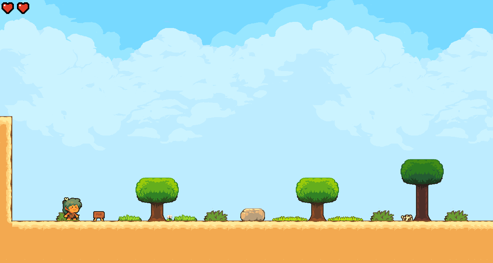

# Rock Run Rose's odyssey

## TLDR I want to play !

[https://uggla.itch.io/rockrun](https://uggla.itch.io/rockrun).

## Overview

Rock Run Rose's Odyssey is a 2D old-school platformer game.

In this game, you play as Rose, a young girl with green eyes living in
prehistoric times. She ventured far from home in search of food, but
dusk is approaching, and the night is dangerous, especially because of
predators. Your mission is to help her avoid dangers and solve puzzles so
she can return home safely.

It is aimed at children around 8 years old, with the objective of enhancing
reading skills through story following and mathematics (addition, subtraction,
doubling, etc.) for puzzle solving while playing.

The game is programmed in Rust and serves as an experiment with the Bevy
framework.

All assets are under CC0 license, most of them coming from the repository
[https://github.com/sparklinlabs/superpowers-asset-packs](https://github.com/sparklinlabs/superpowers-asset-packs)
and [https://kenney.nl/](https://kenney.nl/).
Consider supporting Kenney with a donation, as his work is fantastic and
greatly aids hobbyists in game development.

[https://github.com/BorisBoutillier/Kataster](https://github.com/BorisBoutillier/Kataster)
is a great example of using Bevy, and the game draws inspiration and uses
parts of the code from this repository.

You can modify levels using [Tiled](https://www.mapeditor.org/), an excellent tool for this purpose.

## Project status

[](https://github.com/uggla/rock_run/actions/workflows/ci.yaml)
[](https://github.com/uggla/rock_run/actions/workflows/release.yaml)

The project is currently in development, and the first release is now
available, although there are still some known bugs (such as collision
issues and the player sliding on horizontally moving platforms). You
can find the binaries on [GitHub](https://github.com/uggla/rock_run) and
itch.io. Additionally, **an online WebAssembly (WASM) version** is available at
[https://uggla.itch.io/rockrun](https://uggla.itch.io/rockrun).

Please note that the code in this project is far from clean or
optimized. I am currently learning Bevy, and I've primarily focused
on progressing the development of the game rather than on the quality
of the code. Additionally, there isn't a predefined plan for this
project, which is growing organically as it evolves. This lack of
structure also contributes to the code's messiness. This project is
mainly a hobby for me, and while I strive to improve my skills and
adopt best practices, my main goal is to create and enjoy the process,
even if the code suffers as a result.

Additionally, this game is being created for my daughter to help her with
reading and calculating. It's important for me to complete the game before
she gets too old for these learning activities.

## Authors

- [@Uggla](https://www.github.com/Uggla)

## Screenshots




## Game controls

Use ⌨️ or 🎮 (left stick) to play.

- ⬅️ and ➡️ move left and right.
- ⬆️ climb ladders, activate stories (❓️) or exit.
- ⬇️ descend ladders.
- 🟢 or **space**, jump or validate.
- ▶️ or **Esc** pause the game.
- ◀️ or **Backspace** go back or exit the game.

## Storage

The game uses the [bevy_pkv](https://docs.rs/bevy_pkv/0.11.1/bevy_pkv)
crate to store language preferences. On native systems, this creates a
`bevy_pkv.redb` database in the system's application data directory. For
WebAssembly (Wasm), it uses local storage.

## Run Locally (mainly for development purposes)

1. Clone the project

```bash
  git clone https://github.com/uggla/rock_run.git
```

2. Go to the project directory

```bash
  cd rock_run
```

### Native

1. Install Rust following the instructions [here](https://www.rust-lang.org/fr/learn/get-started).

   _Tips: the rustup method is the simplest one._

2. Install required library for Bevy

Look at https://bevyengine.org/learn/quick-start/getting-started/setup

3. Run

```bash
cargo rd

or

cargo rr  # for release mode
```

### Wasm32

1. Follow the above instruction of the native build.

2. Add the wasm32 compilation target

```bash
rustup target add wasm32-unknown-unknown
```

3. Run

```bash
cargo rwd

or

cargo rwr  # for release mode
```

## Debugging environment variables

- `RUST_LOG="rock_run=debug"`: Enable debug logs.
- `ROCKRUN_LEVEL`: Select the level to play.
- `ROCKRUN_START_POSITION`: Sets the player's start position.
- `ROCKRUN_GOD_MODE`: Disables deadly collisions.

## Debugging keys

These controls are only available in debug mode.

- F12 display perf ui (https://github.com/IyesGames/iyes_perf_ui).
- W zoom out.
- Z zoom in.

## Known bug

1- Bad framerate and high cpu usage.

This can be due to a driver with incomplete Vulkan support as show below.

```bash
2024-06-16T14:30:01.931071Z  INFO bevy_winit::system: Creating new window "RockRun: Rose's Odyssey" (0v1)
2024-06-16T14:30:01.931597Z  INFO log: Guessed window scale factor: 1
MESA-INTEL: warning: Haswell Vulkan support is incomplete
2024-06-16T14:30:02.213994Z  INFO bevy_render::renderer: AdapterInfo { name: "llvmpipe (LLVM 18.1.6, 256 bits)", vendor: 65541, device: 0, device_type: Cpu, driver: "llvmpipe", driver_info: "Mesa 24.1.1 (LLVM 18.1.6)", backend: Vulkan }
```

This can be fixed by changing the backend from Vulkan to Gl using the following environment variable

```bash
export WGPU_BACKEND=gl
```

2- Log spam from wgpu_hal

```bash
2024-08-15T16:14:27.750208Z ERROR wgpu_hal::gles: wgpu-hal heuristics assumed that the view dimension will be equal to `Cube` rather than `CubeArray`.
`D2` textures with `depth_or_array_layers == 1` are assumed to have view dimension `D2`
`D2` textures with `depth_or_array_layers > 1` are assumed to have view dimension `D2Array`
`D2` textures with `depth_or_array_layers == 6` are assumed to have view dimension `Cube`
`D2` textures with `depth_or_array_layers > 6 && depth_or_array_layers % 6 == 0` are assumed to have view dimension `CubeArray`
```

https://github.com/bevyengine/bevy/issues/13115

At the moment writting this documentation, the issue is still open, but it can be mitigated by filtering out logs.

```bash
RUST_LOG=none,rock_run=info cargo rr
```

3- Menu UI is not rendered well.


This is not fixed yet.

TODO: create a environment variable to change the UI settings.
