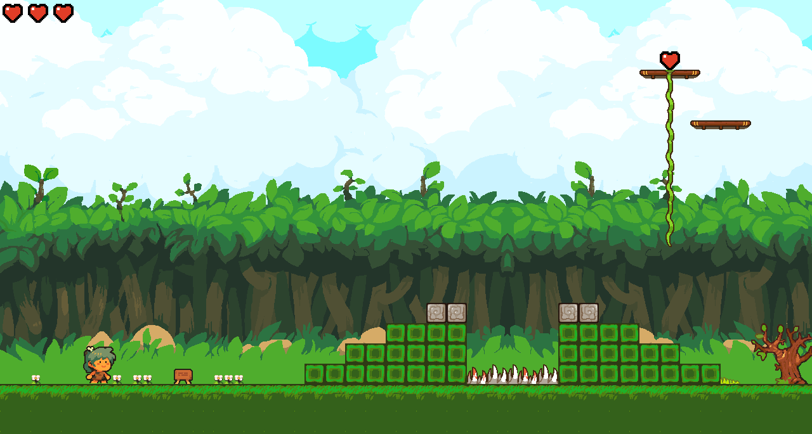
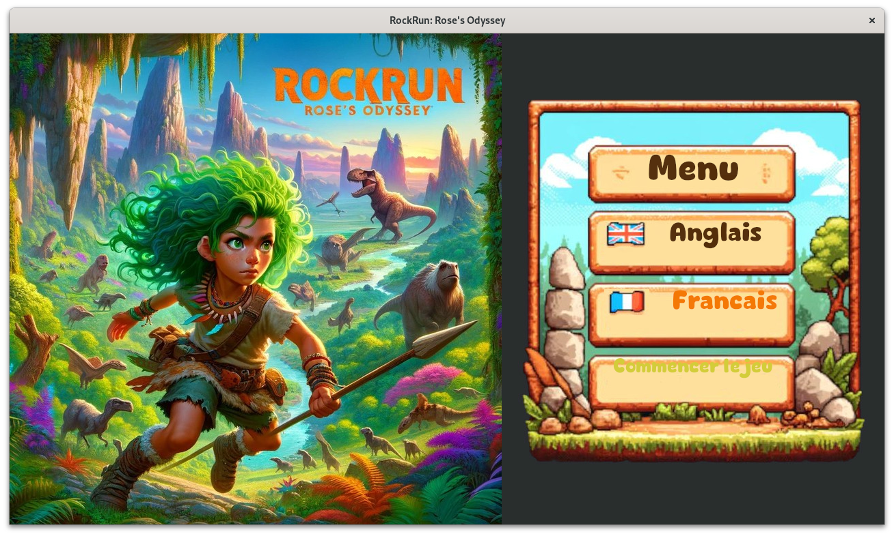

# Rock Run Rose's odyssey

Rock Run Rose's Odyssey is a 2D old-school platformer game. The game is
programmed in Rust and serves as an experiment with the Bevy framework.

It is aimed at children around 7 years old, with the objective of enhancing
reading skills through story following and mathematics (addition, subtraction,
doubling, etc.) for puzzle solving while playing.

All assets are under CC0 license, most of them coming from the repository
[https://github.com/sparklinlabs/superpowers-asset-packs](https://github.com/sparklinlabs/superpowers-asset-packs).

[https://github.com/BorisBoutillier/Kataster](https://github.com/BorisBoutillier/Kataster)
is a great example of using Bevy, and the game draws inspiration and uses
parts of the code from this repository.

## Project status

The project is currently under heavy development, and it does not make
sense to provide binaries at this moment. However, as soon as the state
is sufficiently advanced, binaries and a playable online version will
be released.

Please note that the code in this project may not be as clean or optimized
as it could be. I am currently learning Bevy, and my primary focus has been
on making progress in the development of the game rather than perfecting
the code. This project is a hobby for me, and while I strive to improve
and learn best practices, my main goal is to create and enjoy the process.

Additionally, this game is being created for my daughter to help her with
reading and calculating. It's important for me to complete the game before
she gets too old for these learning activities.

## Authors

- [@Uggla](https://www.github.com/Uggla)

## Screenshots




## Game controls

Use ⌨️ or 🎮 (left stick) to play.

- ⬅️ and ➡️ move left and right.
- ⬆️ climb ladders, activate stories (❓️) or exit.
- ⬇️ descend ladders.
- 🟢 or **space**, jump or validate.
- ▶️ or **Esc** pause the game.
- ◀️ or **Backspace** go back or exit the game.

## Run Locally (mainly for development purposes)

1. Clone the project

```bash
  git clone https://github.com/uggla/rock_run.git
```

2. Go to the project directory

```bash
  cd rock_run
```

### Native

1. Install Rust following the instructions [here](https://www.rust-lang.org/fr/learn/get-started).

   _Tips: the rustup method is the simplest one._

2. Install required library for Bevy

Look at https://bevyengine.org/learn/quick-start/getting-started/setup

3. Run

```bash
cargo rd

or

cargo rr  # for release mode
```

### Wasm32 client

1. Follow the above instruction of the native build.

2. Add the wasm32 compilation target

```bash
rustup target add wasm32-unknown-unknown
```

3. Run

```bash
cargo rwd

or

cargo rwr  # for release mode
```

## Known bug

1- Bad framerate and high cpu usage.

This can be due to a driver with incomplete Vulkan support as show below.

```bash
2024-06-16T14:30:01.931071Z  INFO bevy_winit::system: Creating new window "RockRun: Rose's Odyssey" (0v1)
2024-06-16T14:30:01.931597Z  INFO log: Guessed window scale factor: 1
MESA-INTEL: warning: Haswell Vulkan support is incomplete
2024-06-16T14:30:02.213994Z  INFO bevy_render::renderer: AdapterInfo { name: "llvmpipe (LLVM 18.1.6, 256 bits)", vendor: 65541, device: 0, device_type: Cpu, driver: "llvmpipe", driver_info: "Mesa 24.1.1 (LLVM 18.1.6)", backend: Vulkan }
```

This can be fixed by changing the backend from Vulkan to Gl using the following environment variable

```bash
export WGPU_BACKEND=gl
```

2- Log spam from wgpu_hal

```bash
2024-08-15T16:14:27.750208Z ERROR wgpu_hal::gles: wgpu-hal heuristics assumed that the view dimension will be equal to `Cube` rather than `CubeArray`.
`D2` textures with `depth_or_array_layers == 1` are assumed to have view dimension `D2`
`D2` textures with `depth_or_array_layers > 1` are assumed to have view dimension `D2Array`
`D2` textures with `depth_or_array_layers == 6` are assumed to have view dimension `Cube`
`D2` textures with `depth_or_array_layers > 6 && depth_or_array_layers % 6 == 0` are assumed to have view dimension `CubeArray`
```

https://github.com/bevyengine/bevy/issues/13115

At the moment writting this documentation, the issue is still open, but it can be mitigated by filtering out logs.

```bash
RUST_LOG=none,rock_run=info cargo rr
```

3- Menu UI is not rendered well.



This is not fixed yet.

TODO: create a environment variable to change the UI settings.
